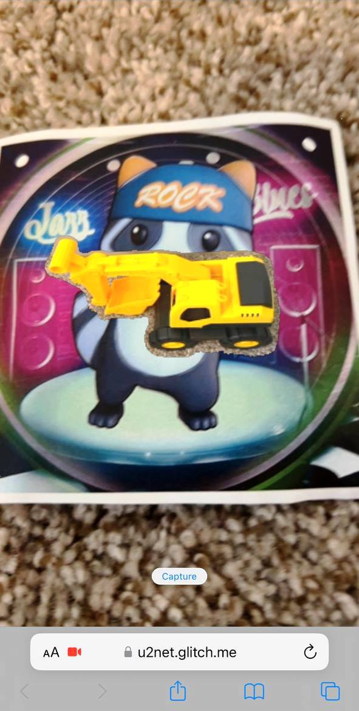

# A-Frame Component: Web-based U2Net


### **Description / Rationale**
This is the A-Frame component, which loads web-based U2Net (for more information check <a href="https://github.com/xuebinqin/U-2-Net">U2Net page</a>) neural network allowing to do salient object detection. The component is compatible with latest version of A-Frame (ver. 1.4.1).   

### **Instructions**
To see the component at work add "u2net" to "a-scene" element. The component has the following attributes: 
* arSystem: { type: "string", default: "mindAR" } - defines which free web-based AR system is used. It can be  "mindAR" or "arJS".
* nnModel: { type: "string", default: "models/u2netp_default.onnx" } - indicates which U2Net model is used. It has the following options: u2netp_default.onnx, u2netp_320.onnx, u2netp_224.onnx, u2netp_124.onnx. Default model has better quality than smaller models.  
* uiText: { default: "" } - the text which appears during the loading of the U2Net model. If uiLogo is indicated as well, it will only show this text.
* uiLogo: { default: "" } - the logo url. Logo appears during rhe loading of the U2Net model. If uiText is indicated as well, it will show uiText only. 
* uiOverlayColor: { default: "rgba(0, 0, 0, 1)" } - the color of the overlay which appears during U2Net model loading. RGBA values are accepted.

In order to work, it also requires indication of the following in the head section of html document:
OnnxRuntimeWeb: 
```
<script src="https://cdn.jsdelivr.net/npm/onnxruntime-web/dist/ort.min.js"></script>
```
WebAR system: 
```
<script src="https://cdn.jsdelivr.net/npm/mind-ar@1.2.1/dist/mindar-image-aframe.prod.js"></script> 
```
or  
```
<script src="https://raw.githack.com/AR-js-org/AR.js/master/aframe/build/aframe-ar.js"></script>
```
And a plane with the following parameters inside marker tags:
```
<a-plane id="u2netPlane" width="1" height="1" scale="0 0 0" material="">

 </a-plane>
```  
Example implementation for MindAr.js is given below:
```
<html>
<head>
  <script src="https://aframe.io/releases/1.4.1/aframe.min.js"></script>
  <script src="https://cdn.jsdelivr.net/npm/mind-ar@1.2.1/dist/mindar-image-aframe.prod.js"></script>
  <!-- import ONNXRuntime Web from CDN -->
  <script src="https://cdn.jsdelivr.net/npm/onnxruntime-web/dist/ort.min.js"></script>
    <!-- Component -->
  <script src="js/u2net-component.js"></script>
</head>
<body> 
  <a-scene u2net="uiText: Loading cool experience...; nnModel: models/u2netp_default.onnx"
    mindar-image="imageTargetSrc: https://cdn.jsdelivr.net/gh/hiukim/mind-ar-js@1.2.1/examples/image-tracking/assets/band-example/band.mind;"
    vr-mode-ui="enabled: false" device-orientation-permission-ui="enabled: false">
    <a-entity mindar-image-target="targetIndex: 0">
      <a-plane id="u2netPlane" width="1" height="1" scale="0 0 0" material="">
        
      </a-plane>
    </a-entity>
    <a-camera position="0 0 0" look-controls="enabled: false"></a-camera>
  </a-scene>
</body>
</html>
```
Example implementation for AR.js is given below:
```
<html>
<head>
    <script src="https://aframe.io/releases/1.4.1/aframe.min.js"></script>
    <!-- we import arjs version without NFT but with marker + location based support -->
    <script src="https://raw.githack.com/AR-js-org/AR.js/master/aframe/build/aframe-ar.js"></script>
  <!-- import ONNXRuntime Web from CDN -->
  <script src="https://cdn.jsdelivr.net/npm/onnxruntime-web/dist/ort.min.js"></script>
    <!-- Component -->
  <script src="js/u2net-component.js"></script>
</head>
<body> 
  <a-scene u2net="uiText: Loading...; arSystem: arJS"
  embedded arjs>
    <a-marker preset="hiro">
      <a-plane id="u2netPlane" width="1" height="1" scale="0 0 0" material="">
         
      </a-plane>
    </a-marker>
    <a-entity camera></a-entity>
  </a-scene>
</body>
</html>
```
### **Performance on Mobile Devices**
Depending on the capacity of a mobile device the performance can be faster or slower. Changing default model to smaller models can help.   

### **U2Net Models**
The default model is an optimized model. All other models were reduced to corresponding sizes.
 
### **Tech Stack**
The project is powered by AFrame and Three.js in combination of free webAR systems as MindAR.js and AR.js.  

### **Demo**
See demo of the component here: [Demo](https://u2net.glitch.me/)
